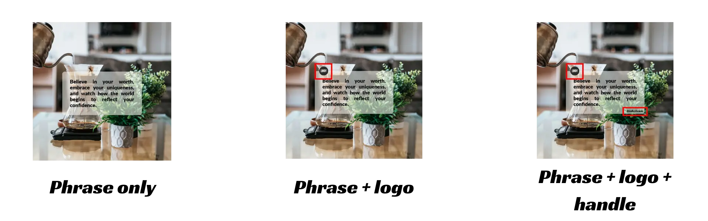

# Post Generator

**Post Generator** is a Python program that helps you instantly create beautiful Instagram posts based on a phrase, logo, and handle provided by the user. Whether you're running a personal brand or a business account, this tool can help you create aesthetic, shareable content efficiently.



## 📌 Features

- Accepts custom phrases to be displayed on Instagram posts.
- Optionally supports uploading a logo and Instagram handle.
- Uses a set of 20 pre-loaded background images to be used to generate the posts.
- Matches each phrase with a corresponding background image to generate polished posts.
- Generates up to 20 unique posts based on the user's phrases, logo, and handle.

## ⚙️ Installation

1. **Clone the repository**  
   ```bash
   https://github.com/DavidLee95/post_generator.git
   ```

2. **Install dependencies** 
- It's recommended to use a virtual environment.
     ```bash
     pip install -r requirements.txt
     ```

## 🚀 Usage

1. **Load the desired phrases to "phrases.txt".**
- Go to the file named "phrases.txt", in which there is one phrase per line. 
- Delete all the sample phrases in there and fill up to 20 phrases that you wish to use to generate your Instagram posts.

   ```
   ├── LICENSE
   ├── README.md
   ├── background_images
   ├── fonts
   ├── generated_posts
   ├── images
   ├── main.py
   ├── phrases.txt (add the phrases here)
   └── requirements.txt
   ```

2. **Upload a logo in PNG to include it in the image (optional)**
- Go to the "images" folder. 
- Upload the logo and call it "logo.png".

   ```
   ├── LICENSE
   ├── README.md
   ├── background_images
   ├── fonts
   ├── generated_posts
   ├── images
   │   ├── logo.png (this is how the logo must be added)
   │   └── readme_description.webp
   ├── main.py
   ├── phrases.txt
   └── requirements.txt
  ```

3. **Initialize the code**
   ```bash
   python main.py
   ```
  
4. **Select the number of posts to generate and the Instagram account's handle (optional)**
   ```txt
   How many posts do you want to generate? (The maximum is 20): 
   Please write the Instagram account's handle or simply press enter to not include it:
   ```

5. **Verify the generated posts**
   ```
   ├── LICENSE
   ├── README.md
   ├── background_images
   ├── fonts
   ├── generated_posts
   │   ├── post1.png (First post)
   │   └── post2.png (Second post)
   │   └── post{n}.png ({n} post)
   │   └── post14.png (Last post)
   ├── images
   ├── main.py
   ├── phrases.txt
   └── requirements.txt
   ```

## 🛠 Tech Stack
* Language: Python
* Libraries: Pillow, os

## 🧑‍💻 Contributing
Pull requests are welcome! If you'd like to improve the project, feel free to fork it and submit a PR. Please make sure your contributions follow best practices and are well-tested.

## 📄 License
This project is under the terms of the [MIT license](https://opensource.org/license/mit/).
